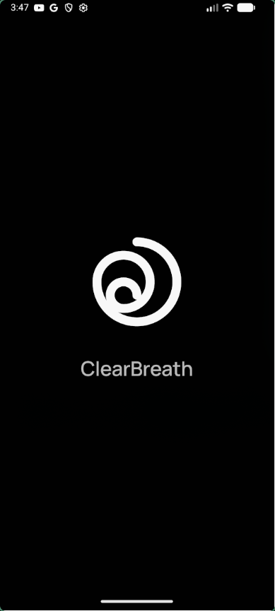
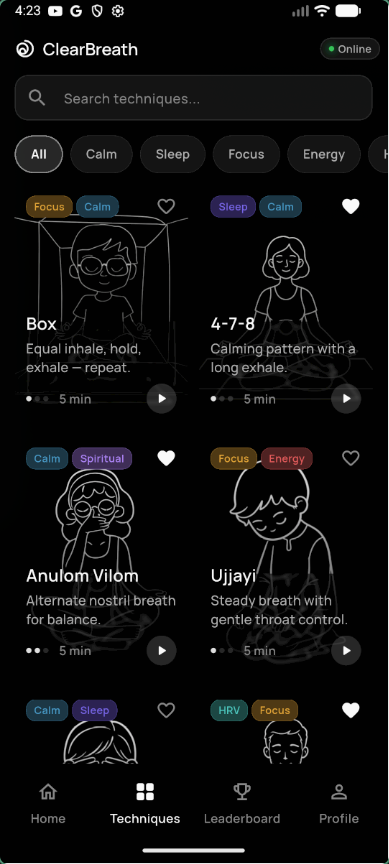
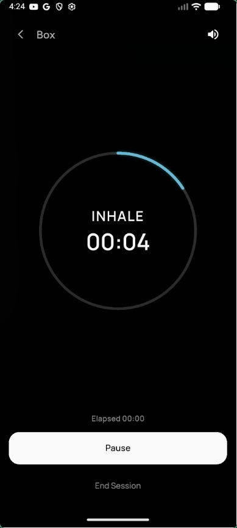
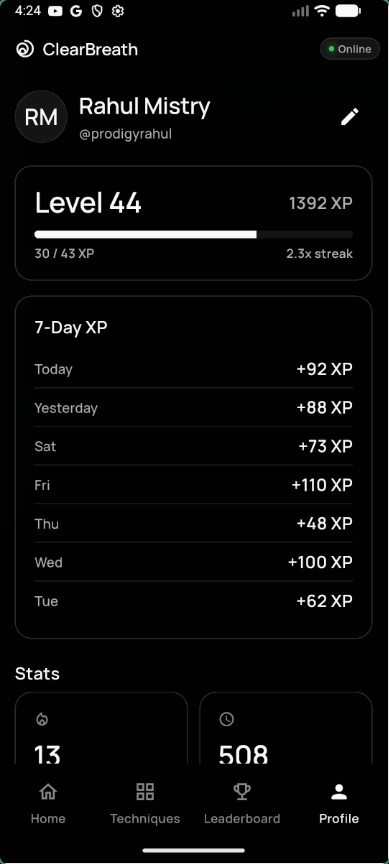
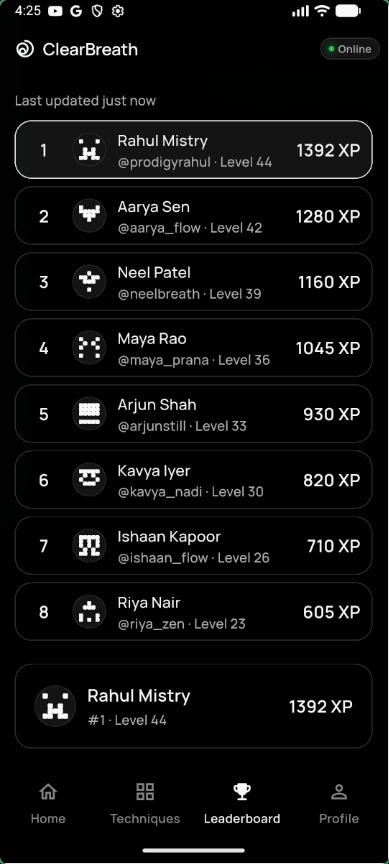

<p align="center">
  
</p>

<h1 align="center">ClearBreath</h1>

<p align="center">A free, open-source pranayama and breathing exercise platform.</p>

<p align="center">
  <a href="https://github.com/purebreathlabs/clearbreath/actions/workflows/server.yml">
    
  </a>
  <a href="https://github.com/purebreathlabs/clearbreath/actions/workflows/mobile.yml">
    
  </a>
  <a href="LICENSE">
    
  </a>
  <a href="CHANGELOG.md">
    
  </a>
</p>

## Why ClearBreath

Most breathing and mindfulness apps lock core routines behind subscriptions,
interrupt practice with ads, or ask users to trust a closed product with
personal wellness data. ClearBreath takes the opposite approach.

ClearBreath is built to stay always free, open source, and easy to inspect.
No paywalls. No subscriptions. No ads. No data selling.

It is designed for practitioners who want guided pranayama sessions, streaks,
stats, and gentle structure without extra friction.

## Screenshots

<p align="center">
  
  &nbsp;
  
  &nbsp;
  
  &nbsp;
  
  &nbsp;
  
</p>

## Tech Stack

| Component | Technology | Directory |
| --- | --- | --- |
| Server | Go 1.25, Chi, PostgreSQL 17, Redis 7 | `server/` |
| Mobile | Flutter 3.38, Riverpod, Drift | `apps/mobile/` |
| Web | Astro, Tailwind CSS | `apps/web/` |
| CI/CD | GitHub Actions | `.github/workflows/` |

## Quick Start

### Prerequisites

- Go 1.25+
- Flutter 3.38+
- Bun 1.3+
- PostgreSQL 17
- Redis 7+
- Docker

If Flutter is not on your `PATH`, pass `FLUTTER=~/sdk/flutter/bin/flutter` to
mobile `make` commands.

### Clone the Repo

```bash
git clone https://github.com/purebreathlabs/clearbreath.git
cd clearbreath
```

### Install Dependencies

```bash
make setup
```

### Configure Local Environment

```bash
cp .env.example server/.env
```

### Start Local Services

```bash
make docker-up
```

### Run the API

```bash
make server-dev
```

### Verify the API

```bash
curl http://localhost:8080/health
```

### Run the Mobile App

```bash
make mobile-run
```

By default, the mobile app points at the hosted API.
For Android emulator testing against your local API, use:

```bash
make mobile-run API_BASE_URL=http://10.0.2.2:8080 MOBILE_RUN_ARGS="--dart-define=DEV_AUTH_ENABLED=true"
```

For a physical Android device on the same Wi-Fi network, replace `10.0.2.2`
with your machine's local IP.

### Run the Web App

```bash
make web-dev
```

## Project Structure

```text
.
├── .github/
├── apps/
│   ├── mobile/
│   └── web/
├── assets/
├── scripts/
├── server/
├── Makefile
├── VERSION
└── melos.yaml
```

## Current Focus

- Finishing the public open-source launch and contributor onboarding
- Hardening CI for a `dev` branch workflow
- Polishing mobile experience and launch readiness

## Roadmap

- Google Play launch
- App Store launch
- Documentation website
- Alpha and beta testing program
- Landing page improvements
- Community features and improvements

## Contributing

Contributions are welcome across code, docs, tests, and community operations.
Please read [CONTRIBUTING.md](CONTRIBUTING.md) before opening a pull request.
All contributor pull requests should target the `dev` branch.

Production deployment infrastructure is maintainer-only and kept outside the
public repository.

## Community

- Contributors: https://github.com/purebreathlabs/clearbreath/graphs/contributors
- Support: see [SUPPORT.md](SUPPORT.md)
- GitHub Discussions will be enabled as the community grows
- Discord link coming soon

Thank you to everyone who contributes to ClearBreath.

## Sponsors

ClearBreath is and will remain always free.
If you find it valuable, consider sponsoring the project to help cover hosting
and development costs:
https://github.com/sponsors/prodigyrahul

## About PureBreathLabs

PureBreathLabs builds breathing tools that stay accessible to everyone.
The goal is simple: always free, open source, no paywalls, and no
subscriptions.

## Maintainers

- Rahul Mistry
- GitHub: [`@prodigyrahul`](https://github.com/prodigyrahul)
- X: [`@_rahulmistry`](https://x.com/_rahulmistry)
- Discord: `prodigyrahul`
- Email: `rahulmistry.sde@gmail.com`

## License

This project is licensed under the MIT License.
See [LICENSE](LICENSE) for details.
